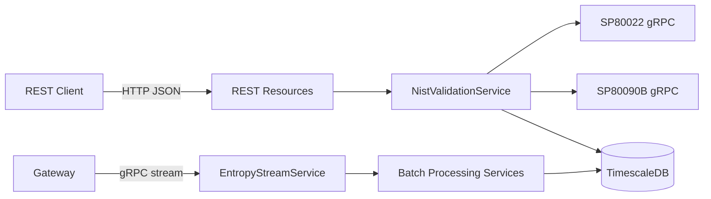

# API Reference

This document describes the interfaces exposed by `entropy-processor` and the external RPC interfaces it consumes.

## 1. REST API

Base path: `/api/v1`

Security model from code/config:

1. `/api/*` requires authenticated access by default.
2. Selected methods use `@PermitAll`.
3. Most protected endpoints require `ADMIN_ROLE` or `USER_ROLE`.
4. Administrative endpoint requires `ADMIN_ROLE` only.

## 2. REST Endpoints by Resource

### 2.1 EntropyResource

| Method | Path | Access | Purpose |
|---|---|---|---|
| GET | `/entropy/shannon` | `ADMIN_ROLE`, `USER_ROLE` | Shannon entropy over a time window |
| GET | `/entropy/renyi` | `ADMIN_ROLE`, `USER_ROLE` | Renyi entropy over a time window |
| GET | `/entropy/comprehensive` | `ADMIN_ROLE`, `USER_ROLE` | Shannon, Renyi, Sample, Approximate entropy bundle |
| GET | `/entropy/window` | `ADMIN_ROLE`, `USER_ROLE` | Time-window entropy analysis |
| GET | `/entropy/nist/latest` | `PermitAll` | Latest SP 800-22 aggregate result |
| POST | `/entropy/nist/validate` | `ADMIN_ROLE`, `USER_ROLE` | Queue async SP 800-22 validation job |
| POST | `/entropy/nist/validate90b` | `ADMIN_ROLE`, `USER_ROLE` | Queue async SP 800-90B validation job |
| GET | `/entropy/nist/validate/status/{jobId}` | `ADMIN_ROLE`, `USER_ROLE` | Read async validation job status |
| GET | `/entropy/nist/validate/result/{jobId}` | `ADMIN_ROLE`, `USER_ROLE` | Read SP 800-22 job result |
| GET | `/entropy/nist/validate90b/result/{jobId}` | `ADMIN_ROLE`, `USER_ROLE` | Read SP 800-90B job result |

### 2.2 EventsResource

| Method | Path | Access | Purpose |
|---|---|---|---|
| GET | `/events/recent` | `ADMIN_ROLE`, `USER_ROLE` | Paginated/filtered event list (legacy `count` also supported) |
| GET | `/events/count` | `ADMIN_ROLE`, `USER_ROLE` | Event count in time window |
| GET | `/events/statistics` | `ADMIN_ROLE`, `USER_ROLE` | Aggregate interval statistics |
| GET | `/events/intervals` | `ADMIN_ROLE`, `USER_ROLE` | Interval statistics view |
| GET | `/events/quality` | `ADMIN_ROLE`, `USER_ROLE` | Data quality assessment report |
| GET | `/events/rate` | `PermitAll` | Event rate versus configured expected rate |
| GET | `/events/interval-histogram` | `ADMIN_ROLE`, `USER_ROLE` | Histogram of inter-event intervals |

### 2.3 PublicEventsResource

| Method | Path | Access | Purpose |
|---|---|---|---|
| GET | `/public/recent-activity` | `PermitAll` | Public minimal recent activity projection |

### 2.4 ValidationResource

| Method | Path | Access | Purpose |
|---|---|---|---|
| GET | `/validation/jobs` | `ADMIN_ROLE`, `USER_ROLE` | Paginated validation jobs |
| GET | `/validation/test-results` | `ADMIN_ROLE`, `USER_ROLE` | Paginated SP 800-22 test rows |
| GET | `/validation/90b-results` | `ADMIN_ROLE`, `USER_ROLE` | Paginated SP 800-90B result rows |
| GET | `/validation/90b-results/{assessmentRunId}/estimators` | `ADMIN_ROLE`, `USER_ROLE` | Estimator-level 90B results, optional `testType` filter |

### 2.5 ComparisonResource

| Method | Path | Access | Purpose |
|---|---|---|---|
| GET | `/comparison/results` | `ADMIN_ROLE`, `USER_ROLE` | Recent comparison runs |
| GET | `/comparison/{runId}/results` | `ADMIN_ROLE`, `USER_ROLE` | Source-level results for one run |
| GET | `/comparison/summary` | `ADMIN_ROLE`, `USER_ROLE` | Summary of latest run |
| POST | `/comparison/trigger` | `ADMIN_ROLE` | Trigger asynchronous comparison run |

### 2.6 AdministrationResource

| Method | Path | Access | Purpose |
|---|---|---|---|
| GET | `/system/config` | `ADMIN_ROLE` | Returns `501 Not Implemented` placeholder |

## 3. gRPC Interfaces

### 3.1 Exposed by entropy-processor

Service: `entropy.EntropyStream`

| RPC | Type | Access Annotation in Service | Purpose |
|---|---|---|---|
| `StreamEntropy` | Bidirectional streaming | `@RolesAllowed("GATEWAY_ROLE")` | Batch ingestion + acknowledgements |
| `SubscribeBatches` | Server streaming | `@RolesAllowed({"ADMIN_ROLE", "USER_ROLE"})` | Broadcast of ingested batches |
| `Control` | Bidirectional streaming | `@Authenticated` | Control-plane messages (`Hello`, `ConfigUpdate`, `HealthReport`, `Ping/Pong`) |

Global gRPC auth interception is implemented by `OidcAuthInterceptor`.

### 3.2 Consumed by entropy-processor

| External Service | RPC | Used By | Purpose |
|---|---|---|---|
| `nist.sp800_22.v1.Sp80022TestService` | `RunTestSuite` | `NistValidationService`, `EntropyComparisonService` | SP 800-22 statistical suite execution |
| `nist.sp800_90b.v1.Sp80090bAssessmentService` | `AssessEntropy` | `NistValidationService`, `EntropyComparisonService` | SP 800-90B min-entropy assessment |
| `grpc.health.v1.Health` | `Check` | `Nist22ServiceHealthCheck`, `Nist90BServiceHealthCheck` | Readiness probing of external NIST services |

## 4. Interface Interaction Diagram

## 5. Notes on Response Contracts

The repository defines many DTO types (`dto/*`), but this document focuses on interface boundaries and endpoint responsibilities. For thesis usage, DTO schemas can be traced directly to:

1. Resource method signatures and OpenAPI annotations in `resource/*`.
2. DTO records under `src/main/java/com/ammann/entropy/dto`.
