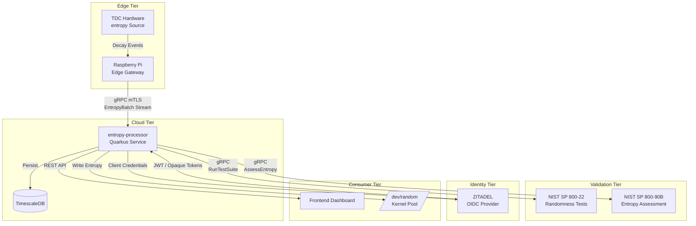
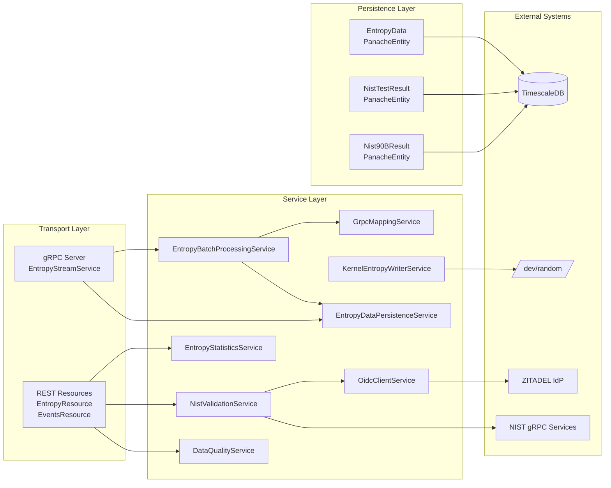
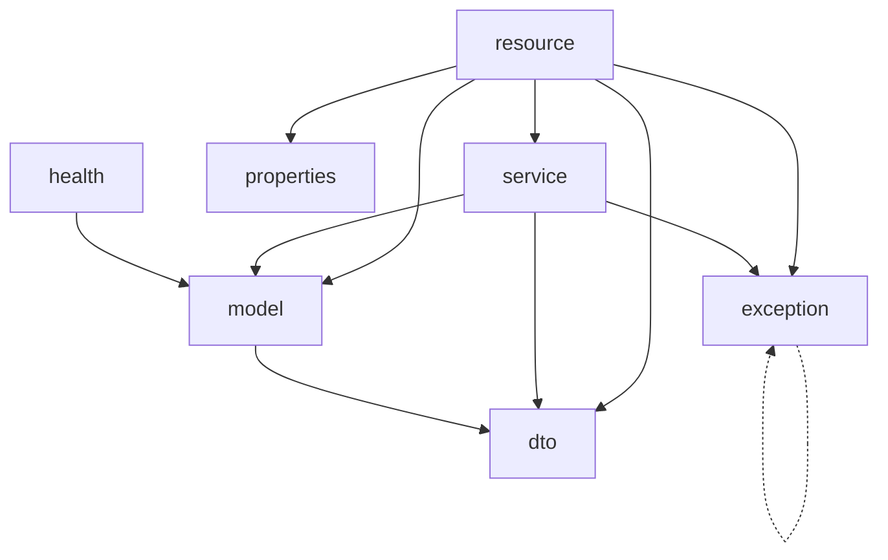
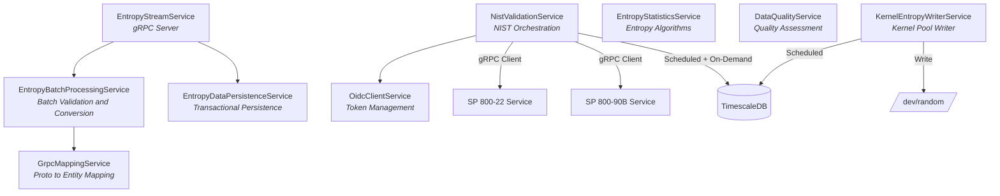
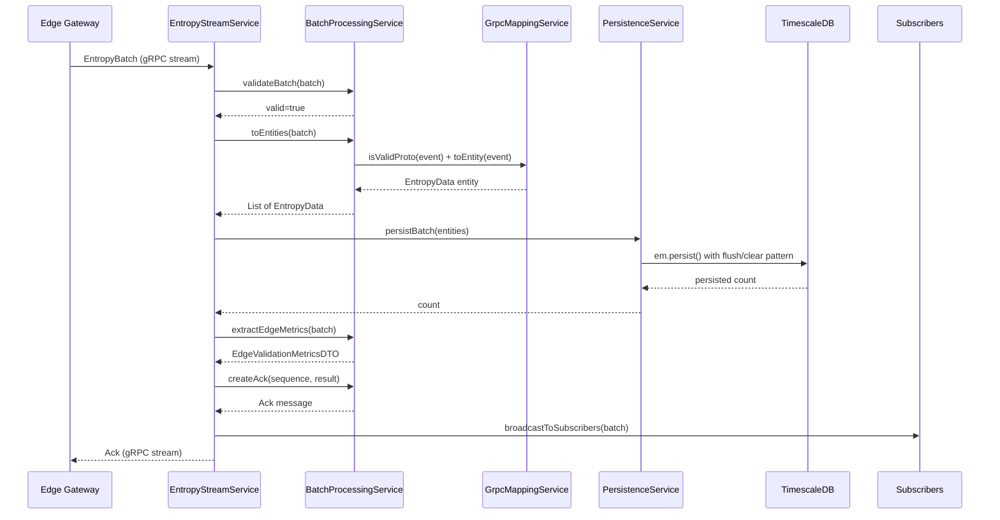
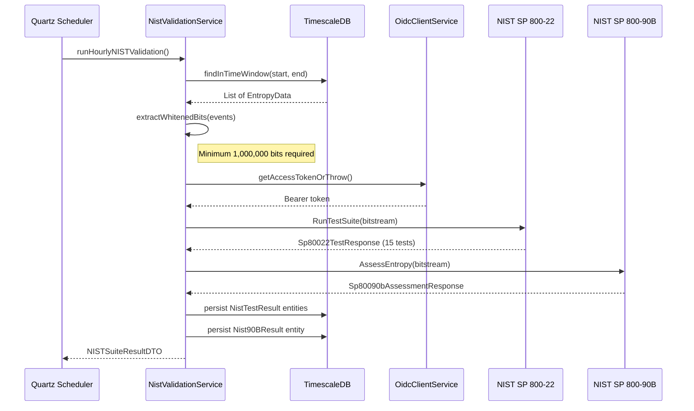
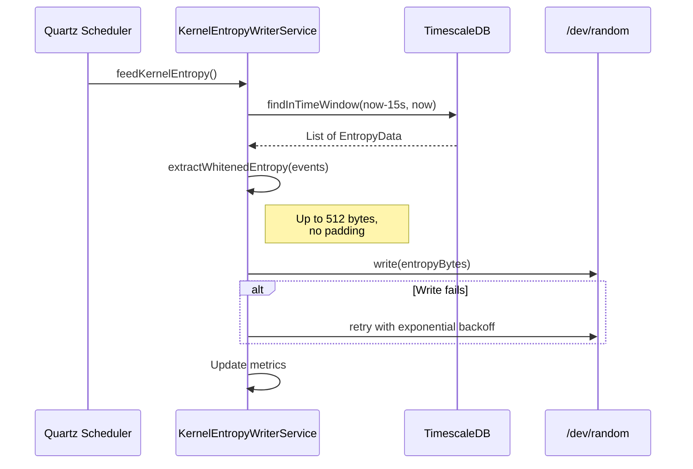
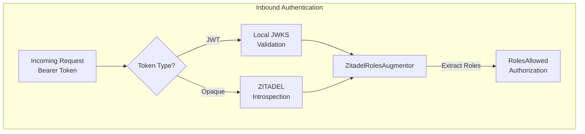

# Architecture Overview

This document describes the internal architecture of the entropy-processor microservice, its component organization, service interactions, and design decisions. The content is structured for direct reuse in an academic Bachelor thesis.

## Table of Contents

1. [System Context](#system-context)
2. [High-Level Architecture](#high-level-architecture)
3. [Package Structure and Module Boundaries](#package-structure-and-module-boundaries)
4. [Service Layer Architecture](#service-layer-architecture)
5. [Data Ingestion Pipeline](#data-ingestion-pipeline)
6. [NIST Validation Pipeline](#nist-validation-pipeline)
7. [Kernel Entropy Writer](#kernel-entropy-writer)
8. [Security Architecture](#security-architecture)
9. [Observability and Health Monitoring](#observability-and-health-monitoring)
10. [Deployment Model](#deployment-model)
11. [Design Decisions and Rationale](#design-decisions-and-rationale)

## System Context

The entropy-processor service operates as the cloud-tier backend in a three-tier architecture for hardware-based true random number generation. The complete system comprises:

- **Edge Tier**: Raspberry Pi gateways equipped with TDC hardware that captures entropy radioactive decay events and transmits them as gRPC streams.
- **Cloud Tier**: The entropy-processor Quarkus service, which ingests, validates, persists, and analyses decay event data.
- **Validation Tier**: External NIST SP 800-22 and SP 800-90B services that perform formal statistical randomness testing and min-entropy assessment, respectively.
- **Identity Tier**: A ZITADEL instance providing OIDC-based authentication and role management.
- **Consumer Tier**: Frontend dashboards, monitoring systems, and the Linux kernel entropy pool, all of which consume the validated entropy data.

## High-Level Architecture

Internally, the entropy-processor service follows a layered architecture with clear separation between transport, business logic, and persistence concerns. The Quarkus CDI container manages the lifecycle of all application-scoped beans.

## Package Structure and Module Boundaries

The application source code is organized into seven packages, each encapsulating a distinct concern. The following table summarizes the responsibility of each package.

| Package | Responsibility | Key Classes |
|---|---|---|
| `service` | Business logic, gRPC service implementation, entropy computation, NIST orchestration, kernel writer, data quality assessment | `EntropyStreamService`, `EntropyBatchProcessingService`, `EntropyDataPersistenceService`, `EntropyStatisticsService`, `NistValidationService`, `DataQualityService`, `KernelEntropyWriterService`, `GrpcMappingService`, `OidcClientService` |
| `resource` | JAX-RS REST endpoints for entropy analysis, event queries, and NIST validation | `EntropyResource`, `EventsResource` |
| `model` | JPA entities with Panache active record queries and TimescaleDB-aware schema annotations | `EntropyData`, `NistTestResult`, `Nist90BResult`, `IntervalStats` |
| `dto` | Immutable Java records with OpenAPI schema annotations for API request/response serialization | `NISTSuiteResultDTO`, `EntropyStatisticsDTO`, `BatchProcessingResultDTO`, `EdgeValidationMetricsDTO`, `NIST90BResultDTO`, and others |
| `exception` | Application exception hierarchy and global JAX-RS exception mapper | `ApiException`, `ValidationException`, `NistException`, `GlobalExceptionHandler` |
| `security` | ZITADEL-specific role extraction from JWT and opaque token introspection responses | `ZitadelRolesAugmentor` |
| `health` | SmallRye Health readiness probes for database connectivity | `DatabaseHealthCheck` |
| `properties` | Centralized constants for REST API path segments | `ApiProperties` |

### Dependency Graph Between Packages

The `service` package contains the most significant concentration of logic. It is the only package that interacts with external systems (gRPC clients, OIDC provider, kernel device). The `resource` package delegates all computation to services and is limited to request parsing, parameter validation, and response construction.

## Service Layer Architecture

The service layer comprises nine CDI beans, each annotated with `@ApplicationScoped`. The following diagram illustrates their interactions and responsibilities.

### EntropyStreamService

The `EntropyStreamService` is annotated with `@GrpcService` and implements the `EntropyStream` protocol buffer service definition. It provides three RPC methods:

1. **StreamEntropy** (bidirectional streaming): Receives `EntropyBatch` messages from edge gateways and returns `Ack` responses. Each batch undergoes validation, entity conversion, transactional persistence, and subscriber broadcast. Backpressure is signaled when the internal processing queue exceeds 800 items out of a 1000-item buffer.

2. **SubscribeBatches** (server-side streaming): Maintains a concurrent map of subscriber contexts, each with a rate-limited emitter. Connected clients receive copies of ingested batches in real time, subject to a configurable maximum of 20 batches per second per subscriber.

3. **Control** (bidirectional streaming): Handles gateway handshake (`Hello`), configuration distribution (`ConfigUpdate`), health reports (`HealthReport`), and latency probes (`Ping`/`Pong`).

### EntropyBatchProcessingService

This service acts as the bridge between the gRPC transport and the persistence layer. Its responsibilities include:

- Converting `EntropyBatch` protocol buffer messages into lists of `EntropyData` JPA entities
- Validating batch integrity (non-empty event lists, edge metric plausibility)
- Constructing `Ack` responses with processing metadata
- Extracting edge validation metrics into `EdgeValidationMetricsDTO` records

### EntropyDataPersistenceService

Implements the transactional persistence of `EntropyData` entities using Hibernate ORM with Panache. For high-throughput batch ingestion, the service employs an `EntityManager` flush/clear pattern with a configurable batch size of 100 entities to prevent excessive memory consumption during large batch processing (up to 1,840 events per batch).

### EntropyStatisticsService

Implements four entropy computation algorithms over lists of inter-event time intervals:

| Algorithm | Formula | Complexity | Use Case |
|---|---|---|---|
| Shannon Entropy | H(X) = -sum(p(x) log2 p(x)) | O(n) | Classical information-theoretic entropy measure |
| Renyi Entropy | H_alpha(X) = 1/(1-alpha) log2(sum(p_i^alpha)) | O(n) | Parameterized generalization; alpha=2 yields collision entropy |
| Sample Entropy | -ln(A/B) where A,B are template match counts | O(n^2) | Time-series regularity measure |
| Approximate Entropy | phi(m) - phi(m+1) | O(n^2) | Pattern complexity measure, suitable for shorter datasets |

The quadratic-complexity algorithms (Sample Entropy and Approximate Entropy) automatically downsample inputs exceeding 2,000 samples using uniform sampling to prevent excessive computation time while preserving statistical properties.

### NistValidationService

Orchestrates the complete NIST validation pipeline:

1. Loads entropy events from TimescaleDB for a specified time window
2. Extracts whitened bitstreams (preferring stored whitened entropy, falling back to interval-based XOR folding)
3. Invokes the external NIST SP 800-22 gRPC service (`RunTestSuite`) for the full 15-test randomness suite
4. Invokes the external NIST SP 800-90B gRPC service (`AssessEntropy`) for IID and non-IID min-entropy assessment
5. Persists all test results to TimescaleDB
6. Returns structured result DTOs with pass/fail status and recommendations

The service supports two execution modes:

- **Scheduled**: A Quartz cron job (`0 0 * * * ?`) triggers hourly validation of the preceding hour's data
- **On-demand**: The REST API enables manual validation of arbitrary time windows

Authentication for outbound gRPC calls uses a dual-mode strategy: token propagation from incoming REST requests (for user-initiated validation) or service-to-service client credentials via `OidcClientService` (for scheduled validation).

### KernelEntropyWriterService

Periodically writes validated whitened entropy bytes to the Linux kernel random pool. Key design characteristics:

- Reads recent whitened entropy from TimescaleDB (last 15 seconds of events)
- Writes up to 512 bytes per cycle to `/dev/random` using plain `write()` system calls
- Employs exponential backoff retry logic (up to 3 attempts)
- Writes only genuine whitened entropy; no deterministic padding is used
- Requires `CAP_DAC_OVERRIDE` capability and device mapping in containerized deployments

### OidcClientService

Manages the OIDC client credentials flow for service-to-service authentication. Provides:

- Automatic token caching and refresh via Quarkus OIDC Client
- A circuit breaker pattern that opens after 5 consecutive failures and resets after 60 seconds
- Graceful degradation when OIDC is not configured
- Prometheus metrics for token fetch success, failure, and latency

## Data Ingestion Pipeline

The following sequence diagram illustrates the end-to-end flow of a single entropy batch from edge gateway to persistent storage.

### Backpressure Mechanism

The ingestion pipeline implements backpressure signaling to prevent the edge gateway from overwhelming the server. When the internal processing queue size exceeds 800 items (out of a buffer capacity of 1,000), the `Ack` response includes `backpressure=true` with a descriptive reason. The gateway is expected to reduce its send rate in response.

### Event Validation

Events undergo two-stage validation:

1. **Proto-level validation** (`GrpcMappingService.isValidProto`): Ensures non-zero timestamps and temporal plausibility (events within a 24-hour past window and 60-second future tolerance).
2. **Batch-level validation** (`EntropyBatchProcessingService.validateBatch`): Rejects empty batches and logs warnings for batches with failing edge-side frequency or runs tests.

## NIST Validation Pipeline

The validation pipeline requires a minimum of 1,000,000 bits (125,000 bytes) of whitened entropy data. If the time window does not contain sufficient data, the service raises a `NistException` and records a failure metric.

## Kernel Entropy Writer

The kernel entropy writer uses `write()` to `/dev/random`, which mixes entropy into the kernel pool without crediting it (RNDADDENTROPY ioctl would require `CAP_SYS_ADMIN`). This design ensures transparent integration with downstream consumers such as drand that read from `/dev/urandom`.

## Security Architecture

### Authentication Flow

The service supports two token types for inbound authentication:

1. **JWT tokens**: Validated locally using JWKS keys fetched from ZITADEL's discovery endpoint
2. **Opaque tokens**: Validated via introspection call to ZITADEL's introspection endpoint

### Role-Based Access Control

ZITADEL encodes project-scoped roles under the custom claim `urn:zitadel:iam:org:project:roles` as a JSON object whose keys are role names. The `ZitadelRolesAugmentor` extracts these role names and adds them to the Quarkus `SecurityIdentity`, enabling standard `@RolesAllowed` annotations.

Three roles govern access across the application:

| Role | Scope |
|---|---|
| `GATEWAY_ROLE` | gRPC `StreamEntropy` RPC (batch ingestion) |
| `ADMIN_ROLE` | All REST API endpoints |
| `USER_ROLE` | All REST API endpoints |

Public endpoints (health probes, metrics, OpenAPI specification, gRPC health, and gRPC reflection) are exempt from authentication via HTTP authorization policy configuration.

### Outbound Authentication

For outbound gRPC calls to NIST services, the service uses one of two authentication strategies:

1. **Token propagation**: The bearer token from an incoming REST request is forwarded to the NIST gRPC service via the `withBearerToken()` method, which attaches an Authorization header using gRPC metadata interceptors
2. **Client credentials**: The `OidcClientService` obtains a service token using the `private_key_jwt` client authentication method (RFC 7523)

### Mutual TLS

All production gRPC communication (both inbound from edge gateways and outbound to NIST services) is secured with mutual TLS. The server presents its certificate and requires a valid client certificate signed by the trusted CA. Certificate reload is configured at 1-minute intervals in production and 15-minute intervals in development.

## Observability and Health Monitoring

### Prometheus Metrics

The service exposes the following custom metrics through the Micrometer Prometheus registry on port 9090:

| Metric | Type | Description |
|---|---|---|
| `batches_received_total` | Counter | Total entropy batches received via gRPC |
| `batches_processed_success_total` | Counter | Successfully processed batches |
| `batches_processed_failed_total` | Counter | Failed batch processing attempts |
| `events_persisted_total` | Counter | Total events persisted to TimescaleDB |
| `batch_processing_duration_seconds` | Timer | Batch processing latency |
| `nist_validation_failures_total` | Counter | NIST validation failure count |
| `kernel_entropy_bytes_written_total` | Counter | Bytes written to kernel pool |
| `kernel_entropy_write_failures_total` | Counter | Failed kernel writes |
| `entropy_oidc_token_fetch_success_total` | Counter | Successful token fetches |
| `entropy_oidc_token_fetch_failure_total` | Counter | Failed token fetches |
| `entropy_oidc_token_fetch_duration` | Timer | Token fetch latency |

### Health Checks

The `DatabaseHealthCheck` implements a SmallRye Readiness probe that verifies TimescaleDB connectivity and query performance. It reports DOWN if a basic count query exceeds 1 second, indicating degraded database performance. The check exposes total event count, recent event count (last hour), and query latency as health check data.

Health and metrics endpoints are served on a dedicated management port (9090), separate from the application port (9080/9443).

## Deployment Model

The Dockerfile provides four build targets:

| Target | Base Image | Use Case |
|---|---|---|
| `dev` | `maven:3.9.9-eclipse-temurin-21` | Hot reload development with Quarkus dev mode |
| `prod` | `ubi9/openjdk-21-runtime:1.23` | Production JVM deployment |
| `native-builder` | `ubi-quarkus-mandrel-builder-image:jdk-21` | GraalVM native compilation stage |
| `prod-native` | `ubi9/ubi-minimal:9.5` | Minimal production image with native executable |

All production images run as non-root users, expose ports 9080 (HTTP), 9090 (management), and 9443 (TLS), and include Docker HEALTHCHECK directives polling the liveness endpoint.

### Network Ports

| Port | Protocol | Purpose |
|---|---|---|
| 9080 | HTTP/1.1 + HTTP/2 | REST API and gRPC (plaintext) |
| 9443 | HTTPS + gRPC/TLS | REST API and gRPC (mTLS) |
| 9090 | HTTP | Management interface (health, metrics) |
| 5005 | TCP | JVM remote debug (dev mode only) |

The gRPC server shares the Vert.x HTTP server on the same port, avoiding a second TCP listener and enabling single TLS termination. gRPC clients negotiate HTTP/2 via ALPN.

## Design Decisions and Rationale

### Shared HTTP/gRPC Port

The decision to co-locate REST and gRPC on the same Vert.x listener (`quarkus.grpc.server.use-separate-server=false`) reduces operational complexity by requiring only one TLS termination point and one set of certificates. This is feasible because Quarkus Vert.x supports HTTP/2 and HTTP/1.1 multiplexing on the same port.

### TimescaleDB Hypertables

The `entropy_data` table is converted to a TimescaleDB hypertable partitioned by `server_received` with 1-day chunks. This decision is motivated by the expected ingestion rate of approximately 600 events per second, which produces approximately 50 million rows per day. Daily chunking balances query performance for time-range queries against chunk management overhead.

NIST test result tables use 7-day chunks, reflecting their lower write frequency (typically one suite execution per hour).

### Flush/Clear Persistence Pattern

The `EntropyDataPersistenceService` flushes the JPA persistence context every 100 entities during batch inserts. This pattern prevents the first-level cache from growing unboundedly during large batch processing (up to 1,840 events per batch), trading slightly increased database round-trips for predictable memory consumption.

### Whitened Entropy Derivation

Two whitening strategies are implemented:

1. **Primary**: Stored whitened entropy bytes from the `GrpcMappingService`, which XOR-folds the 8-byte TDC picosecond timestamp against the 8-byte RPI microsecond timestamp to produce an 8-byte whitened output per event.
2. **Fallback**: When no pre-whitened data is available, the `NistValidationService` derives entropy from inter-event intervals by sorting events, computing consecutive deltas, serializing them as `long` values, and XOR-folding the resulting byte array.

Both strategies apply simple reversible folding. The XOR operation serves as a lightweight conditioning step; formal entropy extraction is delegated to the NIST SP 800-90B assessment service.

### Circuit Breaker for Token Management

The `OidcClientService` implements a simple circuit breaker to prevent cascading failures when the ZITADEL identity provider is unavailable. After 5 consecutive token fetch failures, the circuit opens and all subsequent requests fail immediately for 60 seconds before the circuit attempts to reset. This protects the scheduled NIST validation pipeline from blocking on unresponsive OIDC endpoints.