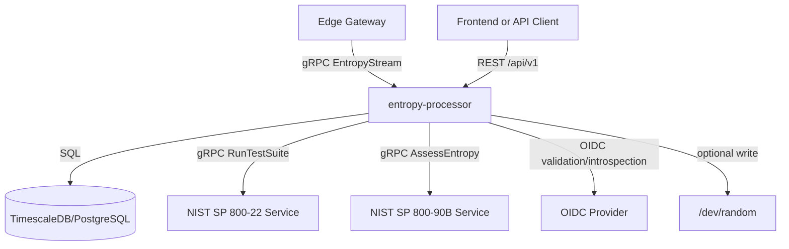
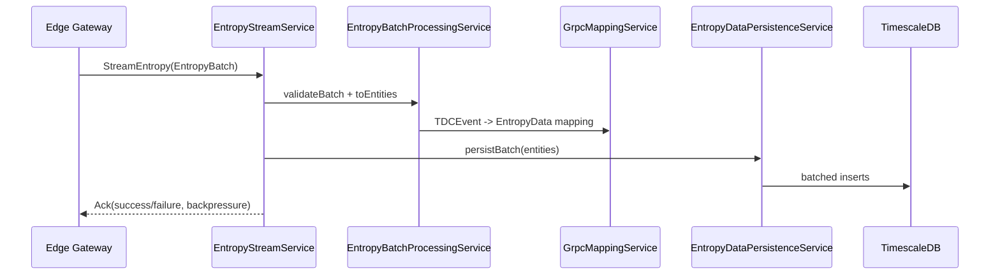
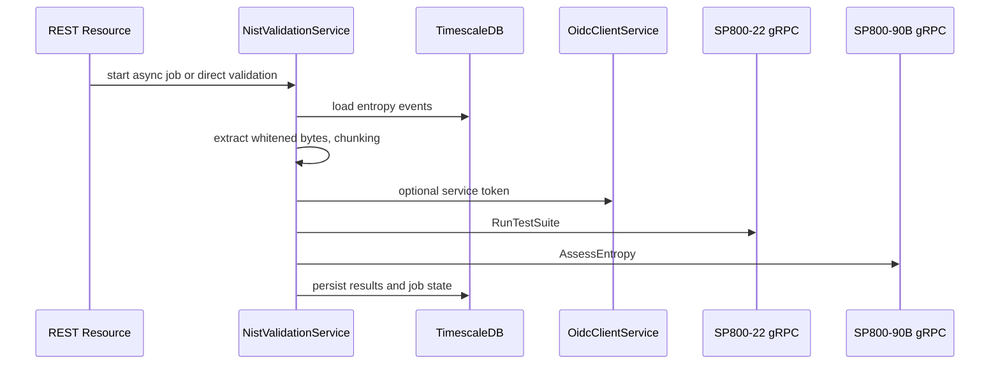

# Architecture Overview

This document describes the architecture of the `entropy-processor` module based strictly on repository artifacts under `entropy-processor/`.

## 1. Architectural Role in the Repository

`entropy-processor` is the central processing service for entropy event ingestion, persistence, analysis, and validation orchestration.

At module level, the evidence indicates the following interaction surface:

- Inbound gRPC entropy stream from edge gateways (`src/main/proto/entropy.proto`, `EntropyStreamService`)
- Inbound REST requests for analytics, validation workflows, and operational queries (`resource/*`)
- Outbound gRPC to NIST services (`NistValidationService`, `EntropyComparisonService`)
- Persistence to TimescaleDB/PostgreSQL (`model/*`, Flyway migration)
- Optional output to Linux kernel random pool (`KernelEntropyWriterService`)

## 2. High-Level Component View

## 3. Internal Module Boundaries

### 3.1 Transport and API Layer

- `service/EntropyStreamService`: gRPC server implementation for `StreamEntropy`, `SubscribeBatches`, and `Control`.
- `resource/*`: REST API resources for entropy metrics, events, validation jobs, comparison operations, and one administrative stub endpoint.

### 3.2 Application Service Layer

- Ingestion and mapping: `EntropyBatchProcessingService`, `GrpcMappingService`, `EntropyDataPersistenceService`
- Analytics and quality: `EntropyStatisticsService`, `DataQualityService`
- Validation orchestration: `NistValidationService`, `NistJobMaintenanceService`, `startup/NistJobRecoveryService`
- Comparison workflow: `EntropyComparisonService`
- Security helpers: `JwtValidationService`, `OidcClientService`
- Kernel integration: `KernelEntropyWriterService`

### 3.3 Persistence Layer

- Panache entities in `model/*`
- Schema defined in `db/migration/V1__initial_schema.sql`
- Timescale hypertables for high-volume time-indexed tables

### 3.4 Cross-Cutting Runtime Components

- Security interception for gRPC: `interceptor/OidcAuthInterceptor`
- OIDC role augmentation: `security/ZitadelRolesAugmentor`
- Health checks: `health/*`
- Async executor production: `config/ExecutorProducer`

## 4. Service Interaction Patterns

### 4.1 Ingestion and Persistence Path

Key architectural traits visible in code:

1. Buffered streaming with backpressure signaling (`BUFFER_SIZE=1000`, threshold `800`).
2. Conversion and validation separated from persistence.
3. Persistence batching with periodic `flush/clear` to bound memory.

### 4.2 Validation Orchestration Path

Key architectural traits visible in code:

1. Asynchronous job model with persisted progress (`nist_validation_jobs`).
2. Scheduled and on-demand execution coexist.
3. Authentication propagation strategy: request token when present, service token fallback otherwise.

## 5. Security Architecture

### 5.1 REST Security

- Global HTTP auth policy protects `/api/*`.
- Method-level role restrictions in resources (`@RolesAllowed`, targeted `@PermitAll` for selected endpoints).

### 5.2 gRPC Security

- `OidcAuthInterceptor` is a global gRPC interceptor.
- Public bypass only for health/reflection methods.
- Token validation delegated to `JwtValidationService` (JWT signature validation and optional introspection path).

### 5.3 Role Mapping

- `ZitadelRolesAugmentor` extracts role names from ZITADEL-specific claim structures and adds them to `SecurityIdentity`.

## 6. Operational Architecture

### 6.1 Scheduling and Background Work

- SP 800-22 scheduled job (`nist.sp80022.hourly-cron`)
- SP 800-90B scheduled job (`nist.sp80090b.weekly-cron`)
- Validation job watchdog and cleanup schedules
- Entropy comparison schedule (`entropy.comparison.schedule.cron`)
- Kernel entropy writer periodic task (`kernel.entropy.writer.interval`)

### 6.2 Startup Recovery

- `NistJobRecoveryService` marks `QUEUED` and `RUNNING` jobs as `FAILED` on restart to avoid orphaned job state.

### 6.3 Health and Management

- Liveness and readiness via SmallRye Health.
- Readiness includes database check and optional NIST service checks.
- Management interface enabled on dedicated port (`quarkus.management.port=9090`).

## 7. Evidence-Based Limits and Uncertainty

The repository provides direct evidence for module-internal architecture and declared integrations. It does not fully define external deployment topology (for example, exact production orchestration or network zoning). Therefore, this document intentionally limits system-wide claims to interfaces and dependencies explicitly visible in this module.
