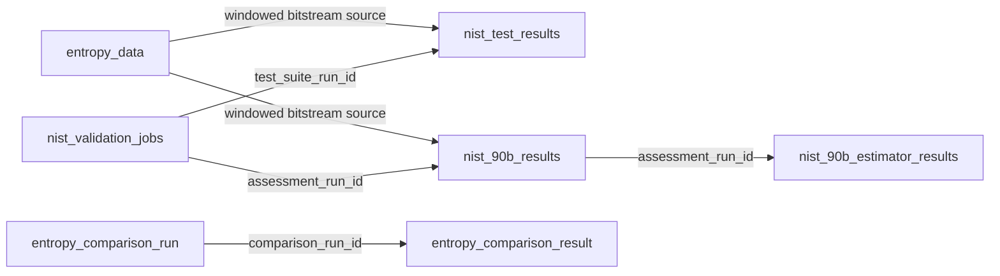
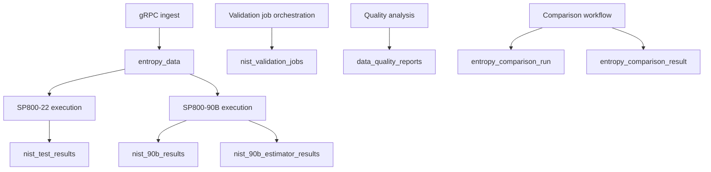

# Data Model

This document describes the persistence model implemented by `entropy-processor`, based on:

1. `src/main/resources/db/migration/V1__initial_schema.sql`
2. Entities under `src/main/java/com/ammann/entropy/model`

## 1. Persistence Approach

- Database: PostgreSQL with TimescaleDB extension.
- Schema lifecycle: Flyway migration at startup.
- ORM: Hibernate ORM + Panache entities.
- Hibernate schema mode: `validate` (migration SQL is the schema source of truth).

## 2. Table Inventory

| Table | Role | Time-Series Type |
|---|---|---|
| `entropy_data` | Primary event storage for ingested entropy events | Hypertable |
| `nist_test_results` | SP 800-22 per-test outcomes | Hypertable |
| `nist_90b_results` | SP 800-90B aggregate assessment outcomes | Hypertable |
| `nist_90b_estimator_results` | SP 800-90B estimator-level detail rows | Regular table |
| `data_quality_reports` | Persisted quality reports | Regular table |
| `nist_validation_jobs` | Async validation job tracking | Regular table |
| `entropy_comparison_run` | Comparison run metadata | Regular table |
| `entropy_comparison_result` | Source-level comparison outcomes | Hypertable |

## 3. Structural Relationships

Note: `nist_90b_estimator_results` intentionally does not enforce a DB foreign key to `nist_90b_results` because of Timescale/partitioning constraints documented in migration comments.

## 4. Table-Level Design Notes

### 4.1 `entropy_data`

Purpose:

1. Stores one row per ingested entropy event.
2. Supports time-window analytics and interval computations.

Key columns:

- `hw_timestamp_ns`, `server_received`, `sequence`, `whitened_entropy`, `source_address`.

Key behavior:

- Converted to hypertable partitioned by `server_received` with 1-day chunks.
- Composite primary key `(id, server_received)` to satisfy Timescale uniqueness constraints.

### 4.2 `nist_test_results`

Purpose:

1. Stores SP 800-22 individual test results.
2. Supports chunked validation runs via `chunk_index` and `chunk_count`.

Key columns:

- `test_suite_run_id`, `test_name`, `passed`, `p_value`, `executed_at`, `details`.

Time-series behavior:

- Hypertable partitioned by `executed_at` (7-day chunk interval).

### 4.3 `nist_90b_results`

Purpose:

1. Stores aggregate SP 800-90B outcomes per chunk/run.
2. Provides run-level link via `assessment_run_id`.

Key columns:

- `assessment_run_id`, `min_entropy`, `passed`, `assessment_details`, `executed_at`.

Time-series behavior:

- Hypertable partitioned by `executed_at` (7-day chunk interval).

### 4.4 `nist_90b_estimator_results`

Purpose:

1. Stores detailed estimator outputs (IID and NON_IID categories).
2. Preserves semantics for non-entropy estimators via nullable `entropy_estimate`.

Key constraints:

- Unique key on `(assessment_run_id, test_type, estimator_name)`.

### 4.5 `data_quality_reports`

Purpose:

- Stores quality assessment summaries generated by quality analysis logic.

Key columns:

- `report_timestamp`, `window_start`, `window_end`, `total_events`, `overall_quality_score`, `recommendations`.

### 4.6 `nist_validation_jobs`

Purpose:

1. Tracks asynchronous validation workflow state.
2. Supports API polling for progress and completion.

Lifecycle states encoded by constraint and enums:

- `QUEUED`, `RUNNING`, `COMPLETED`, `FAILED`.

Key columns:

- `validation_type`, `status`, `progress_percent`, `current_chunk`, `total_chunks`, `test_suite_run_id`, `assessment_run_id`.

### 4.7 Comparison Tables

`entropy_comparison_run`:

- One row per comparison execution, including sample sizes and mixed-source traceability metadata.

`entropy_comparison_result`:

- One or more rows per run, one per source type (`BASELINE`, `HARDWARE`, `MIXED`), with NIST and entropy metric outputs.
- Implemented as hypertable partitioned by `created_at`.

## 5. Data Flow Through Persistence

## 6. Query Boundary Observations

From entity and service code:

1. Time-window access is the dominant access pattern (`server_received` and `executed_at`).
2. Interval analytics are performed using native SQL window functions over `entropy_data`.
3. Validation retrieval uses run identifiers (`test_suite_run_id`, `assessment_run_id`) for aggregation and API responses.
4. Job tracking is independent from test-result tables and linked by run IDs.
