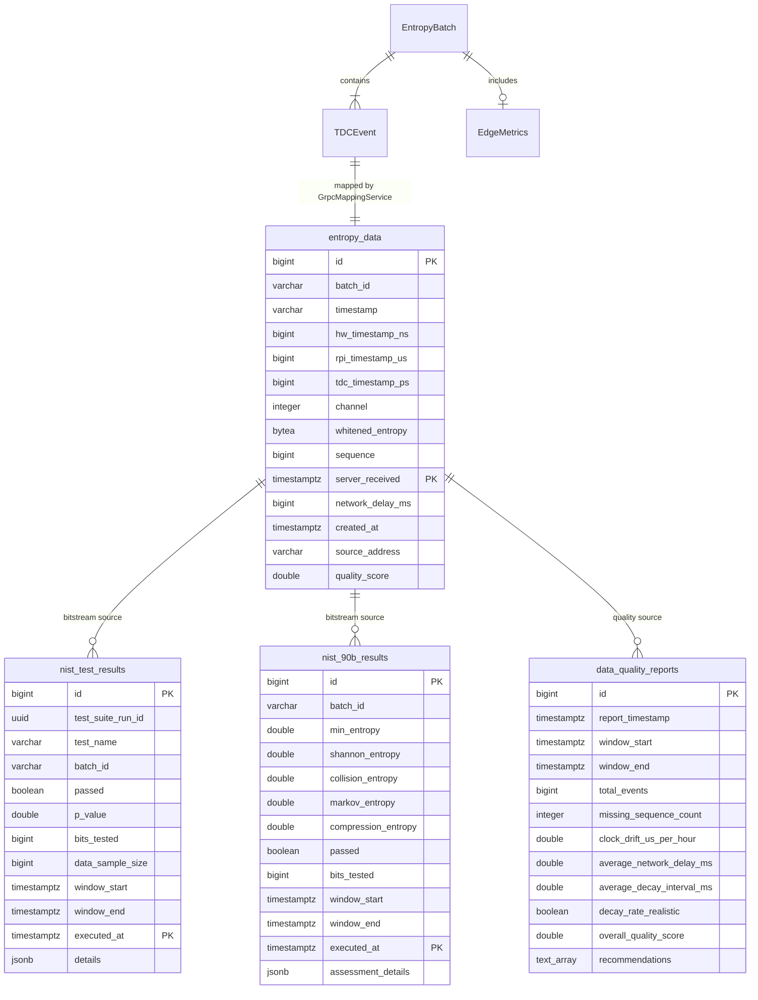

# Data Model

This document describes the persistent data model of the entropy-processor service, including the TimescaleDB schema, JPA entity mappings, and the rationale behind partitioning and indexing decisions. The content is structured for direct inclusion in an academic thesis chapter.

## Table of Contents

1. [Overview](#overview)
2. [Entity-Relationship Diagram](#entity-relationship-diagram)
3. [Table Definitions](#table-definitions)
   1. [entropy_data](#entropy_data)
   2. [nist_test_results](#nist_test_results)
   3. [nist_90b_results](#nist_90b_results)
   4. [data_quality_reports](#data_quality_reports)
4. [TimescaleDB Hypertable Design](#timescaledb-hypertable-design)
5. [JPA Entity Mappings](#jpa-entity-mappings)
6. [Query Patterns](#query-patterns)

## Overview

The entropy-processor service persists data in a TimescaleDB-enabled PostgreSQL database. The schema comprises four tables, three of which are converted to TimescaleDB hypertables for time-series-optimized storage and querying. Schema management is handled by Flyway, which executes migration scripts on application startup. Hibernate ORM is configured in validate-only mode, ensuring that the application schema matches the Flyway-managed database at startup.

The following diagram illustrates the relationships between the four tables and the external gRPC message types that serve as input sources.

## Entity-Relationship Diagram



## Table Definitions

### entropy_data

The primary data table storing individual radioactive decay events captured by TDC hardware on Raspberry Pi edge gateways. Each row represents a single detected decay event.

| Column | Type | Nullable | Description |
|---|---|---|---|
| `id` | `BIGINT` | No | Auto-generated surrogate key (sequence increment: 50) |
| `batch_id` | `VARCHAR(64)` | Yes | Gateway-assigned batch identifier linking events to their source batch |
| `timestamp` | `VARCHAR(64)` | No | ISO-8601 string derived from the gateway ingestion microsecond timestamp (`rpi_timestamp_us`) |
| `hw_timestamp_ns` | `BIGINT` | No | TDC hardware timestamp converted from picoseconds to nanoseconds; primary field for entropy interval calculations |
| `rpi_timestamp_us` | `BIGINT` | Yes | Gateway ingestion timestamp in microseconds since Unix epoch (set when MQTT event is received at edge gateway) |
| `tdc_timestamp_ps` | `BIGINT` | Yes | Raw TDC timestamp in picoseconds (original hardware precision) |
| `channel` | `INTEGER` | Yes | TDC input channel that detected the decay event |
| `whitened_entropy` | `BYTEA` | Yes | 8-byte XOR-folded byte array derived from TDC and RPI timestamps |
| `sequence` | `BIGINT` | No | Monotonically increasing sequence number for gap detection |
| `server_received` | `TIMESTAMPTZ` | No | Server-side reception timestamp; serves as the TimescaleDB partition key |
| `network_delay_ms` | `BIGINT` | Yes | Estimated delay between edge gateway ingestion and cloud server reception, in milliseconds |
| `created_at` | `TIMESTAMPTZ` | No | Row insertion timestamp |
| `source_address` | `VARCHAR(45)` | Yes | IP address of the edge gateway (IPv6-compatible length) |
| `quality_score` | `DOUBLE PRECISION` | Yes | Per-event quality score in the range [0.0, 1.0]; default 1.0 |

**Primary Key**: Composite `(id, server_received)` as required by TimescaleDB for hypertable unique constraints that include the partition column.

**Indexes**:

| Index Name | Columns | Purpose |
|---|---|---|
| `idx_entropy_batch_id` | `batch_id` | Batch-level event lookup |
| `idx_hw_timestamp_ns` | `hw_timestamp_ns` | Chronological event ordering for interval calculations |
| `idx_sequence` | `sequence` | Sequence gap detection |
| `idx_server_received` | `server_received` | Time-range queries (hypertable partition pruning) |
| `idx_entropy_server_received_hw_timestamp_ns` | `(server_received, hw_timestamp_ns)` | Composite index for time-windowed queries with hardware timestamp sort |

### nist_test_results

Stores individual test outcomes from NIST SP 800-22 statistical test suite executions. Each row corresponds to one named test (for example, Frequency, Runs, or Serial) within a test-suite run identified by a shared UUID.

| Column | Type | Nullable | Description |
|---|---|---|---|
| `id` | `BIGINT` | No | Auto-generated surrogate key |
| `batch_id` | `VARCHAR(64)` | Yes | Entropy batch that provided the input data |
| `test_suite_run_id` | `UUID` | No | Groups all tests belonging to a single suite execution |
| `test_name` | `VARCHAR(100)` | No | NIST test identifier (for example, "Frequency (Monobit) Test") |
| `passed` | `BOOLEAN` | No | Whether the test passed at the configured significance level |
| `p_value` | `DOUBLE PRECISION` | Yes | Computed p-value; values at or above 0.01 indicate a pass |
| `bits_tested` | `BIGINT` | Yes | Number of bits submitted to this individual test |
| `data_sample_size` | `BIGINT` | Yes | Original sample size before any truncation |
| `window_start` | `TIMESTAMPTZ` | No | Start of the entropy data time window under test |
| `window_end` | `TIMESTAMPTZ` | No | End of the entropy data time window under test |
| `executed_at` | `TIMESTAMPTZ` | No | Timestamp when this test was executed; serves as partition key |
| `details` | `JSONB` | Yes | Additional test-specific output (sub-test statistics, failure reasons) |

**Primary Key**: Composite `(id, executed_at)`

**Indexes**: `test_suite_run_id`, `executed_at`, `passed`

### nist_90b_results

Stores entropy estimates produced by the NIST SP 800-90B assessment service. Each row records multiple entropy estimator outputs for a single assessment run.

| Column | Type | Nullable | Description |
|---|---|---|---|
| `id` | `BIGINT` | No | Auto-generated surrogate key |
| `batch_id` | `VARCHAR(64)` | Yes | Entropy batch that provided the input data |
| `min_entropy` | `DOUBLE PRECISION` | Yes | Min-entropy estimate in bits per symbol (most conservative bound) |
| `shannon_entropy` | `DOUBLE PRECISION` | Yes | Shannon entropy estimate in bits per symbol |
| `collision_entropy` | `DOUBLE PRECISION` | Yes | Collision entropy estimate (Renyi order 2) in bits per symbol |
| `markov_entropy` | `DOUBLE PRECISION` | Yes | Markov model entropy estimate in bits per symbol |
| `compression_entropy` | `DOUBLE PRECISION` | Yes | Compression-based entropy estimate in bits per symbol |
| `passed` | `BOOLEAN` | No | Whether the overall assessment passed the minimum entropy threshold |
| `bits_tested` | `BIGINT` | Yes | Number of bits submitted for assessment |
| `window_start` | `TIMESTAMPTZ` | No | Start of the assessed time window |
| `window_end` | `TIMESTAMPTZ` | No | End of the assessed time window |
| `executed_at` | `TIMESTAMPTZ` | No | Assessment execution timestamp; serves as partition key |
| `assessment_details` | `JSONB` | Yes | Full estimator-level output from the SP 800-90B service |

**Primary Key**: Composite `(id, executed_at)`

**Indexes**: `executed_at`, `passed`

### data_quality_reports

Stores periodic composite quality assessment reports generated by the `DataQualityService`. This table is not a hypertable because report volume is low and time-based partitioning provides no meaningful benefit.

| Column | Type | Nullable | Description |
|---|---|---|---|
| `id` | `BIGINT` | No | Auto-generated surrogate key |
| `report_timestamp` | `TIMESTAMPTZ` | No | When this report was generated |
| `window_start` | `TIMESTAMPTZ` | No | Start of the analysed event window |
| `window_end` | `TIMESTAMPTZ` | No | End of the analysed event window |
| `total_events` | `BIGINT` | No | Number of events in the window |
| `missing_sequence_count` | `INTEGER` | Yes | Count of missing sequence numbers (packet loss indicator) |
| `clock_drift_us_per_hour` | `DOUBLE PRECISION` | Yes | Estimated clock drift rate in microseconds per hour |
| `average_network_delay_ms` | `DOUBLE PRECISION` | Yes | Mean network delay across all events |
| `average_decay_interval_ms` | `DOUBLE PRECISION` | Yes | Mean inter-event interval in milliseconds |
| `decay_rate_realistic` | `BOOLEAN` | Yes | Whether the observed decay rate is plausible for entropy |
| `overall_quality_score` | `DOUBLE PRECISION` | Yes | Composite quality score in [0.0, 1.0] |
| `recommendations` | `TEXT[]` | Yes | Array of human-readable improvement suggestions |

**Primary Key**: `id`

**Indexes**: `report_timestamp`, `overall_quality_score`, `window_start`

## TimescaleDB Hypertable Design

Three of the four tables are converted to TimescaleDB hypertables upon initial migration. The following table summarizes the partitioning strategy.

| Table | Partition Column | Chunk Interval | Rationale |
|---|---|---|---|
| `entropy_data` | `server_received` | 1 day | Expected ingestion rate of approximately 600 events per second produces approximately 50 million rows per day. Daily chunks balance query performance against management overhead. |
| `nist_test_results` | `executed_at` | 7 days | NIST test suite executions occur at most once per hour. Weekly chunks match the low write frequency while maintaining efficient time-range queries. |
| `nist_90b_results` | `executed_at` | 7 days | Entropy assessments execute alongside SP 800-22 tests. Weekly chunks align with the same low-frequency write pattern. |

TimescaleDB hypertables require that any unique or primary key constraint includes the partition column. This is why `entropy_data` uses a composite primary key `(id, server_received)` rather than a simple `id` primary key. The same constraint applies to the NIST result tables with their `(id, executed_at)` composite keys.

### Chunk Management

TimescaleDB automatically creates and manages chunks (child tables) based on the configured chunk interval. Older chunks can be compressed or dropped using TimescaleDB retention policies without affecting the application layer. The choice of `TIMESTAMPTZ` as the partition column type enables native partition pruning on time-range predicates, which directly benefits the windowed queries used throughout the service.

## JPA Entity Mappings

The three primary tables are mapped to JPA entities that extend `PanacheEntity`, providing active record-style query methods. The mapping relationships are as follows.

### EntropyData

- **Table**: `entropy_data`
- **Superclass**: `PanacheEntity` (provides auto-generated `id` field)
- **Key Methods**:
  - `findInTimeWindow(start, end)`: Returns events ordered by hardware timestamp within a server-received time window
  - `calculateIntervals(start, end)`: Computes inter-event deltas using a native SQL window function (`LAG`)
  - `calculateIntervalStats(start, end)`: Returns aggregated statistics (count, mean, stddev, min, max, median) via a single native query with a CTE
  - `getRecentStatistics(eventCount)`: Computes statistical summary over the most recent N events
  - `isValidForEntropy()`: Validates field constraints and temporal plausibility

### NistTestResult

- **Table**: `nist_test_results`
- **Superclass**: `PanacheEntity`
- **Key Methods**:
  - `findByTestSuiteRun(runId)`: Returns all tests for a specific suite execution
  - `findMostRecentSuiteRunId()`: Finds the UUID of the most recent test suite run
  - `countFailures24h()`: Counts test failures in the last 24 hours
  - `getPassRate(since)`: Calculates pass rate since a given timestamp
  - `findFailures(days)`: Returns all failed tests in the last N days
  - `countTestFailures(testName, since)`: Counts failures for a specific test
  - `toDTO()`: Converts the entity to a `NISTTestResultDTO` for API responses

### Nist90BResult

- **Table**: `nist_90b_results`
- **Superclass**: `PanacheEntity`
- **Key Methods**:
  - `toDTO()`: Converts the entity to a `NIST90BResultDTO` for API responses

## Query Patterns

The service uses a combination of Panache JPQL queries and native SQL for different access patterns.

### Time-Windowed Event Retrieval

Used by `NistValidationService` and `KernelEntropyWriterService` to load events for validation and entropy extraction:

```sql
SELECT * FROM entropy_data
WHERE server_received BETWEEN :start AND :end
ORDER BY hw_timestamp_ns
```

This query benefits from the `idx_entropy_server_received_hw_timestamp_ns` composite index and TimescaleDB chunk pruning on `server_received`.

### Inter-Event Interval Computation

Used by `EntropyResource` to supply interval data to the entropy statistics service:

```sql
SELECT hw_timestamp_ns - lag(hw_timestamp_ns)
       OVER (ORDER BY hw_timestamp_ns) AS delta_ns
FROM entropy_data
WHERE server_received >= :start
  AND server_received < :end
```

The `LAG` window function computes deltas in a single database pass, avoiding the need to transfer all events to the application layer.

### Aggregated Interval Statistics

Used by `EventsResource` to compute statistical summaries without transferring individual events:

```sql
WITH d AS (
  SELECT hw_timestamp_ns - lag(hw_timestamp_ns)
         OVER (ORDER BY hw_timestamp_ns) AS delta_ns
  FROM entropy_data
  WHERE server_received >= :start
    AND server_received < :end
)
SELECT
  count(delta_ns),
  avg(delta_ns)::float8,
  stddev_pop(delta_ns)::float8,
  min(delta_ns),
  max(delta_ns),
  percentile_cont(0.5) WITHIN GROUP (ORDER BY delta_ns)::float8
FROM d
WHERE delta_ns > 0
```

This CTE-based query computes count, mean, population standard deviation, minimum, maximum, and median in a single database round-trip, leveraging PostgreSQL's built-in aggregate functions and ordered-set aggregates.

### Batch Persistence Pattern

The `EntropyDataPersistenceService` uses a flush/clear pattern to persist large batches without exhausting the JPA first-level cache:

```
for each event in batch:
    em.persist(event)
    if (count % 100 == 0):
        em.flush()    // Write to database
        em.clear()    // Release first-level cache
em.flush()            // Final flush for remaining entities
```

This pattern is particularly important for the expected batch size of 1,840 events, where holding all entities in the persistence context simultaneously would cause significant memory pressure.
